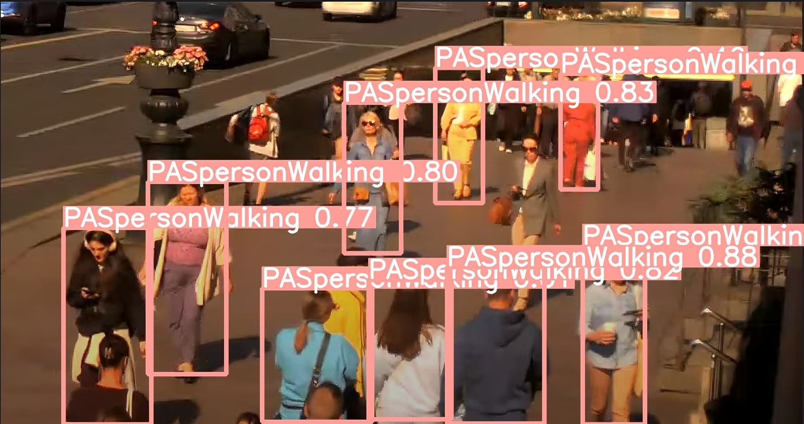
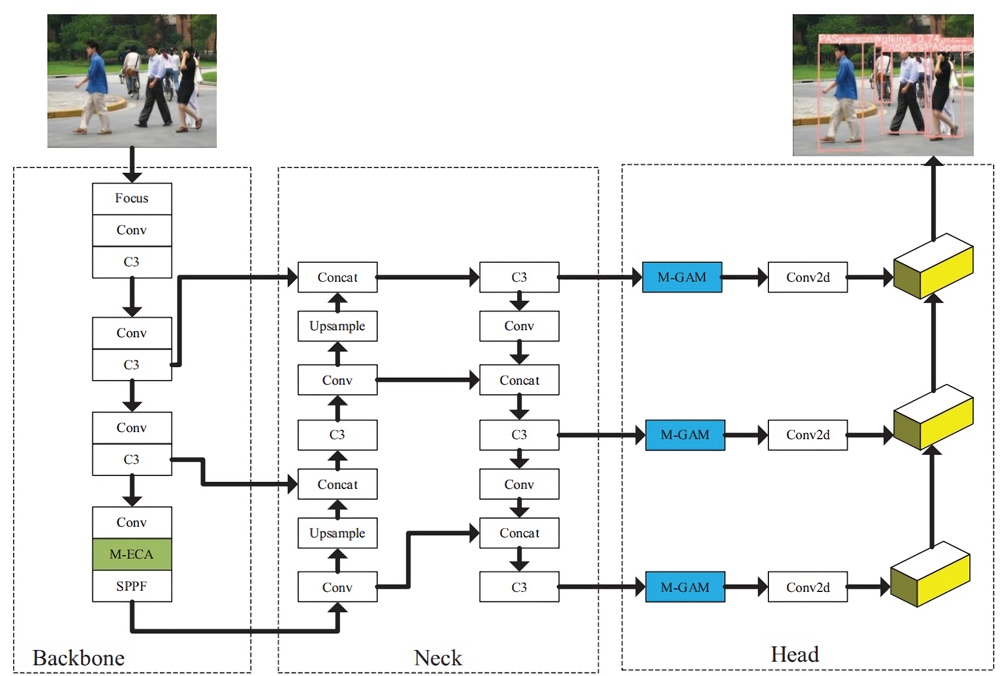

# Pedestrian Detection Using YOLO with Improved Attention Module ([Open Access paper link](https://ieeexplore.ieee.org/document/10473662))

## Introduction

This paper presents an improved Yolov5 's framework for pedestrian detection. We propose two new attention modules for Yolov5 architecture to highlight significant information. First, the modified Efficient Channel Attention (M-ECA) was applied in the backbone of Yolo network to collect the useful features. Second, the modified Global Attention Mechanism (M-GAM) was inserted in the head of Yolo network to enhance feature representation

## Proposed Yolov5 's Architecture

## PenFudan  Dataset

In our experiment, we used dataset **Penn-Fudan**, which included 170 images with 345 labeled pedestrians

The dataset is open for free use, raw data download at (https://www.cis.upenn.edu/~jshi/ped_html/) or data which already precossed (https://universe.roboflow.com/deeplearningresearch/pedestrian-detection-ghbtz ). 

## Results

- **YOLO v5s owns the best mAP, 86.3%.**

 

Figure: Comparision Results.

## Citation
`
@INPROCEEDINGS{10473662,
  author={Vinh, Truong Quang and Long, Pham Hien},
  booktitle={2023 International Conference on Advanced Computing and Analytics (ACOMPA)}, 
  title={Pedestrian Detection Using YOLO with Improved Attention Module}, 
  year={2023},
  volume={},
  number={},
  pages={93-98},
  keywords={YOLO;Analytical models;Pedestrians;Computational modeling;Graphics processing units;Computer architecture;Cameras;Pedestrian Detection;Yolov5;Penn-Fudan;GAM;ECA},
  doi={10.1109/ACOMPA61072.2023.00024}}
`

Or
	
`T. Q. Vinh and P. H. Long, "Pedestrian Detection Using YOLO with Improved Attention Module," 2023 International Conference on Advanced Computing and Analytics (ACOMPA), Da Nang City, Vietnam, 2023, pp. 93-98, doi: 10.1109/ACOMPA61072.2023.00024. keywords: {YOLO;Analytical models;Pedestrians;Computational modeling;Graphics processing units;Computer architecture;Cameras;Pedestrian Detection;Yolov5;Penn-Fudan;GAM;ECA}`

